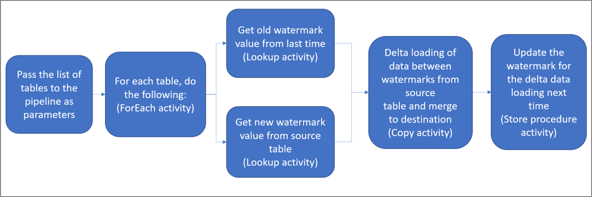
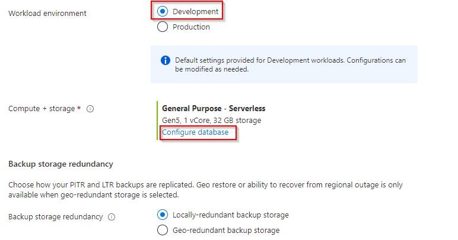
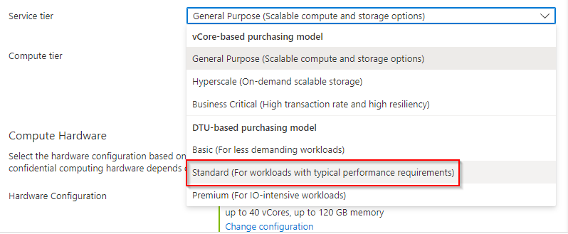
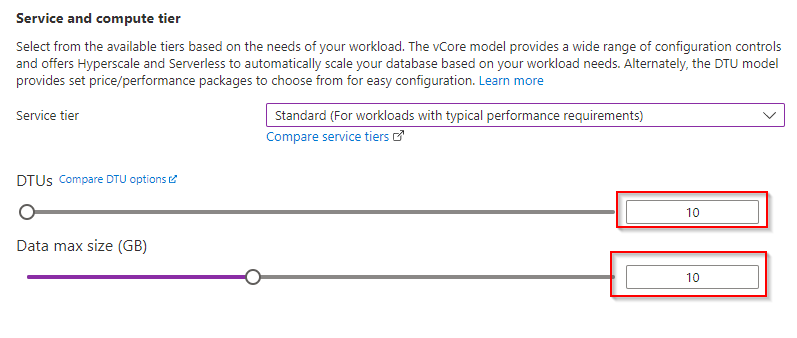
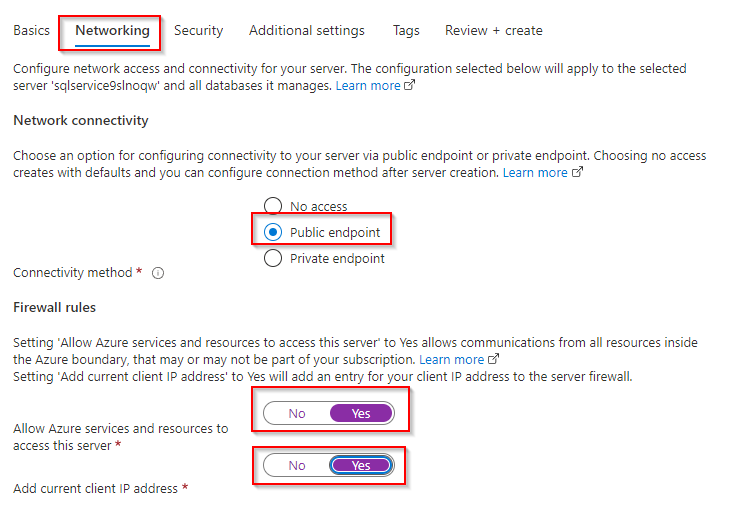
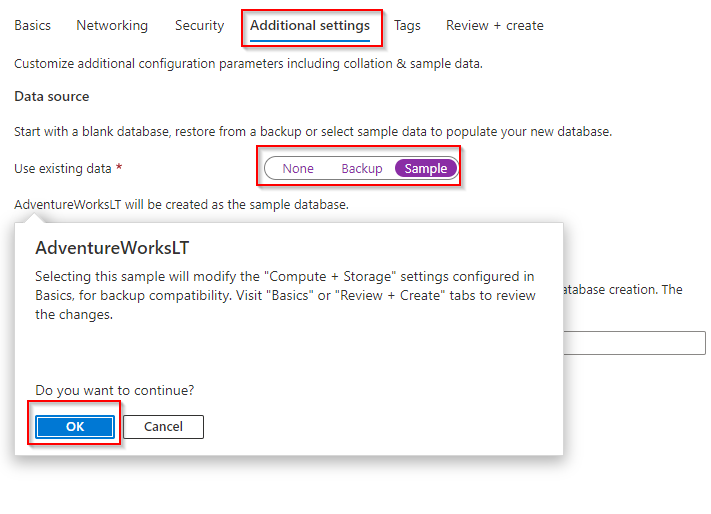

# Lab - Incrementally load data from multiple tables

## Overview

### Here are the important steps to create this solution:

## 1. Select the watermark column.

Select one column for each table in the source data store, which can be used to identify the new or updated records for every run. Normally, the data in this selected column (for example, last_modify_time or ID) keeps increasing when rows are created or updated. The maximum value in this column is used as a watermark.

### 2. Prepare a data store to store the watermark value.

In this tutorial, you store the watermark value in a SQL database.

### 3. Create a pipeline with the following activities:

a. Create a ForEach activity that iterates through a list of source table names that is passed as a parameter to the pipeline. For each source table, it invokes the following activities to perform delta loading for that table.

b. Create two lookup activities. Use the first Lookup activity to retrieve the last watermark value. Use the second Lookup activity to retrieve the new watermark value. These watermark values are passed to the Copy activity.

c. Create a Copy activity that copies rows from the source data store with the value of the watermark column greater than the old watermark value and less than the new watermark value. Then, it copies the delta data from the source data store to Azure Blob storage as a new file.

d. Create a StoredProcedure activity that updates the watermark value for the pipeline that runs next time.

### Here is the high-level solution diagram:

Reference: [Micrsoft Pages](https://docs.microsoft.com/en-us/azure/data-factory/tutorial-incremental-copy-multiple-tables-portal)

In this excercise you will be peforming following task:
- Task 1: Create and configure a SQL Database instance.
- Task 2: Create tables and procedure
- Task 3: Create a pipeline

### Task : Create and configure a SQL Database instance.

1. In the Azure portal, navigate to the **+ Create a resource** blade.

2. In the New screen, click the **Search services and marketplace** text box, and type the word **SQL Database**. Click **SQL Database** in the list that appears.

3. In the **SQL Database** screen, click **Create**.

4. From the **Create SQL Database** screen, create an Azure SQL Database with the following settings:

    - In the Project details section, type in the following information
    
        - **Subscription**: the name of the subscription you are using in this lab

        - **Resource group**: **synapse-xxxxx**, 'xxxxx' is some unique suffix
    
    - In the Database details section, type in the following information
    
        - Database name: type in **AdventureworksLT**
     
        - Server: Create a new server by clicking **Create new** with the following settings and click on **OK**:
            - **Server name**: **sqlservicexxxxx**, where **xxxxx** are your unique suffix
            - **Location**: choose a **location** near as your **data-engineering-synapse-xxxxx** resource group.
            - **Server admin login**: **sqladmin**
            - **Password**: **Pa55w.rd**
            - **Confirm Password**: **Pa55w.rd**
            - click on **OK**
         
         - Want to use SQL elastic pool?:  **No**
         
         - Workload environment: **Development**
        
        - **Cmpute + Storage**: Select Standard Service Tier
        
        Step 1:
        
        
        
        Step 2:
        
        
        
        Step 3:
        
        

	- In the **Networking tab**

		
	
    - Click on the  **Additional setting** tab, click **Sample** . The AdventureworksLT sample database is selected automatically. 
    
		

5. In the **Create SQL Database** blade, click **Review + create**.

6. After the validation of the **Create SQL Database*** blade, click **Create**.

   > **Note**: The provision will takes approximately 4 minutes.

> **Result**: After you completed this task, you have an Azure SQL Database instance
