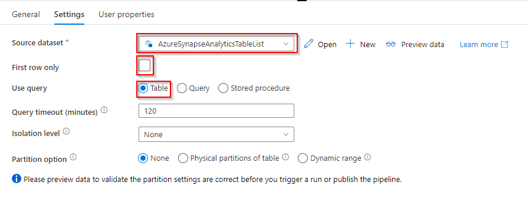
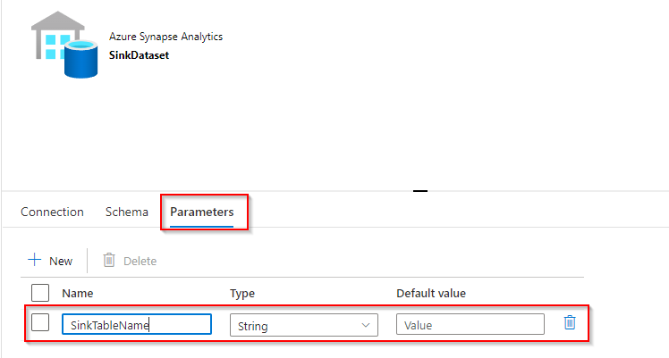

# Lab - Incrementally load data from multiple tables

## Overview

### Here are the important steps to create this solution:

## 1. Select the watermark column.

Select one column for each table in the source data store, which can be used to identify the new or updated records for every run. Normally, the data in this selected column (for example, last_modify_time or ID) keeps increasing when rows are created or updated. The maximum value in this column is used as a watermark.

### 2. Prepare a data store to store the watermark value.

In this tutorial, you store the watermark value in a SQL database.

### 3. Create a pipeline with the following activities:

a. Create a ForEach activity that iterates through a list of source table names that is passed as a parameter to the pipeline. For each source table, it invokes the following activities to perform delta loading for that table.

b. Create two lookup activities. Use the first Lookup activity to retrieve the last watermark value. Use the second Lookup activity to retrieve the new watermark value. These watermark values are passed to the Copy activity.

c. Create a Copy activity that copies rows from the source data store with the value of the watermark column greater than the old watermark value and less than the new watermark value. Then, it copies the delta data from the source data store to Azure Blob storage as a new file.

d. Create a StoredProcedure activity that updates the watermark value for the pipeline that runs next time.

### Here is the high-level solution diagram:


Reference: [Micrsoft Pages](https://docs.microsoft.com/en-us/azure/data-factory/tutorial-incremental-copy-multiple-tables-portal)

In this excercise you will be peforming following task:
- Task 1: Create and configure a SQL Database instance.
- Task 2: Create tables and procedure
- Task 3: Create a pipeline

## Task 1 : Create and configure a SQL Database instance.

1. In the Azure portal, navigate to the **+ Create a resource** blade.

2. In the New screen, click the **Search services and marketplace** text box, and type the word **SQL Database**. Click **SQL Database** in the list that appears.

3. In the **SQL Database** screen, click **Create**.

4. From the **Create SQL Database** screen, create an Azure SQL Database with the following settings:

    - In the Project details section, type in the following information
    
        - **Subscription**: the name of the subscription you are using in this lab

        - **Resource group**: **synapse-xxxxx**, 'xxxxx' is some unique suffix
    
    - In the Database details section, type in the following information
    
        - Database name: type in **AdventureworksLT**
     
        - Server: Create a new server by clicking **Create new** with the following settings and click on **OK**:
            - **Server name**: **sqlservicexxxxx**, where **xxxxx** are your unique suffix
            - **Location**: choose a **location** near as your **data-engineering-synapse-xxxxx** resource group.
            - **Server admin login**: **sqladmin**
            - **Password**: **Pa55w.rd**
            - **Confirm Password**: **Pa55w.rd**
            - click on **OK**
         
         - Want to use SQL elastic pool?:  **No**
         
         - Workload environment: **Development**
        
        - **Cmpute + Storage**: Select Standard Service Tier
        
        Step 1:
        
        
        
        Step 2:
        
        
        
        Step 3:
        
        

	- In the **Networking tab**

		
	
    - Click on the  **Additional setting** tab, click **Sample** . The AdventureworksLT sample database is selected automatically. 
    
		

5. In the **Create SQL Database** blade, click **Review + create**.


6. After the validation of the **Create SQL Database*** blade, click **Create**.

   > **Note**: The provision will takes approximately 4 minutes.

> **Result**: After you completed this task, you have an Azure SQL Database instance


## Task 2: Create table and procedures

### Create source tables in your SQL database

1. Open SQL Database, and connect to your SQL Server database.
  
  
   
2. Run the following SQL command against your database to create tables named customer_table and project_table:.
  
  
  
  ```
create table customer_table
(
    PersonID int,
    Name varchar(255),
    LastModifytime datetime
);

create table project_table
(
    Project varchar(255),
    Creationtime datetime
);

INSERT INTO customer_table
(PersonID, Name, LastModifytime)
VALUES
(1, 'John','9/1/2017 12:56:00 AM'),
(2, 'Mike','9/2/2017 5:23:00 AM'),
(3, 'Alice','9/3/2017 2:36:00 AM'),
(4, 'Andy','9/4/2017 3:21:00 AM'),
(5, 'Anny','9/5/2017 8:06:00 AM');

INSERT INTO project_table
(Project, Creationtime)
VALUES
('project1','1/1/2015 0:00:00 AM'),
('project2','2/2/2016 1:23:00 AM'),
('project3','3/4/2017 5:16:00 AM');
  ```

### Create destination tables in synpase dedicated sql pool

1. In develop hub create a sql script.

   
   
2. Run the following SQL command against your Dedicated SQL Pool to create tables named customer_table and project_table:.
   
   
   
```
create table customer_table
(
    PersonID int,
    Name varchar(255),
    LastModifytime datetime
);
GO

create table project_table
(
    Project varchar(255),
    Creationtime datetime
);
GO

create table table_list
(
    TableName varchar(255),
    WaterMarkColumn varchar(255),
	UpsertColumn varchar(255)
);
GO

INSERT INTO table_list (TableName, WaterMarkColumn, UpsertColumn) VALUES ('customer_table', 'LastModifytime', 'PersonID')
GO

INSERT INTO table_list (TableName, WaterMarkColumn, UpsertColumn) VALUES ('project_table','Creationtime', 'Project')
GO
```

### Create a stored procedure in your database

1. Run the following command to create a stored procedure in your Dedicated SQL Pool. This stored procedure updates the watermark value after every pipeline run
```
create table watermarktable
(

    TableName varchar(255),
    WatermarkValue datetime
);
```
3. Insert initial watermark values for both source tables into the watermark table.
```
INSERT INTO watermarktable VALUES ('customer_table','1/1/2010 12:00:00 AM')
INSERT INTO watermarktable VALUES ('project_table','1/1/2010 12:00:00 AM')
```

### Create a stored procedure in your Dedicated SQL Pool

Run the following command to create a stored procedure in your Dedicated SQL Pool. This stored procedure updates the watermark value after every pipeline run.
```
CREATE PROCEDURE usp_write_watermark @LastModifiedtime datetime, @TableName varchar(50)
AS

BEGIN

UPDATE watermarktable
SET [WatermarkValue] = @LastModifiedtime 
WHERE [TableName] = @TableName

END
```

## Task 3 : Create and configure a pipeline.

### Create SQL Database linked service

1. Under manage hub -> Linked Service -> + New -> Search for SQL Database -> Select SQL Database -> Click Continue

   
   
2. Provide the required configuration details as mentioned

   
   
   

### Create a Pipeline

1. In the left pane, click + (plus), and click Pipeline.

2. In the General panel under Properties, specify IncrementalCopyPipeline for Name. Then collapse the panel by clicking the Properties icon in the top-right corner.

3. Switch to the Settings tab, click + New to create a dataset as shown below
  
   
	
  - Select Azure Synapse Analytics
  
    
  
  - Set properties
    - Dataset Name: ```AzureSynapseAnalyticsTableList```
    - Select Linked Service: **sqlpool01**
    - Select Table Name: **table_list**

    

  - Click: **Ok**
  
  - Under setting tab of Lookup activity
    - Select Frist Row only: **Unchecked**
    - Use query: **Table**
 
      

4. In the Activities toolbox, expand Iteration & Conditionals, and drag-drop the ForEach activity to the pipeline designer surface. In the General tab of the Properties window, enter IterateSQLTables.
    
    

5. Switch to the Settings tab, and enter @activity('LookupTableList').output.value for Items. The ForEach activity iterates through a list of tables and performs the incremental copy operation

   

6. Select the ForEach activity in the pipeline if it isn't already selected. Click the Edit (Pencil icon) button.
7. In the Activities toolbox, expand General, drag-drop the Lookup activity to the pipeline designer surface, and enter LookupOldWaterMarkActivity for Name.
   
   
   
8. Switch to the Settings tab, click + New to create a dataset as mention below:

   - Search for synpase then select Azure Synpase Analytics and click continue.
   - Set properties:
     - Name: ```WatermarkDataset```
     - Linked Service Select: **sqlpool01**
     - Table Name: ```watermarktable```
     - Click" **Ok**
       
       
       
   - First row only: **Checked**.
   - Select Query for Use Query.
   - Enter the following SQL query for Query.
    
     ```
     select * from watermarktable where TableName  =  '@{item().TableName}'
     ```
    
     

9. Drag-drop the Lookup activity from the Activities toolbox, and enter LookupNewWaterMarkActivity for Name.
10. Switch to the Settings tab, click + New to create a dataset as mention below:.

    - Search for sql database then select Azure SQL Database and click continue.
    - Set properties:
      - Name: ```SourceDataset```
      - Linked Service Select: **AzureSqlDatabase**
      - Table Name: **You do not select a table here**. 
      	> **Note**: The Copy activity in the pipeline uses a SQL query to load the data rather than load the entire table.
      - Click" **Ok**
       
        
       
   - Select Query for Use Query.
   - Enter the following SQL query for Query.
   
     ```
     select MAX(@{item().WaterMark_Column}) as NewWatermarkvalue from @{item().TABLE_NAME}
     ```
     
     

11. Drag-drop the Copy activity from the Activities toolbox, and enter IncrementalCopyActivity for Name.
12. Connect Lookup activities to the Copy activity one by one. To connect, start dragging at the green box attached to the Lookup activity and drop it on the Copy activity. Release the mouse button when the border color of the Copy activity changes to blue.

    

13. Select the Copy activity in the pipeline. Switch to the Source tab in the Properties window.

    - Select SourceDataset for Source Dataset.
    - Select Query for Use Query.
    - Enter the following SQL query for Query.
      ```
      select * from @{item().TABLE_NAME} where @{item().WaterMark_Column} > '@{activity('LookupOldWaterMarkActivity').output.firstRow.WatermarkValue}' and @{item().WaterMark_Column} <= '@{activity('LookupNewWaterMarkActivity').output.firstRow.NewWatermarkvalue}'
      ```
      
      
14. Switch to the Sink tab, and click + New for Sink Dataset as mention below:
    
    - Search for synapse then select Azure Synapse Analytics and click continue.
    - Set properties:
      - Name: ```SinkDataset```
      - Linked Service Select: **sqlpool01**
      - Table Name: **You do not select a table here**. 
      - Click" **Ok**
    - In the sink tab select open
      
      
      
15. Switch to the Parameters tab in the Properties window of SinkDataset, and do the following steps:
 
    - Click New in the Create/update parameters section.
    - Enter SinkTableName for the name, and String for the type. This dataset takes SinkTableName as a parameter. The SinkTableName parameter is set by the pipeline dynamically at runtime. The ForEach activity in the pipeline iterates through a list of table names and passes the table name to this dataset in each iteration.
     
      
 
16. Switch back to the Connection tab in the Properties window and For Table property, click Add dynamic content.
 
    - In the Add Dynamic Content window, select SinkTableName in the Parameters section.
    - After clicking Finish, you see "@dataset().SinkTableName" as the table name.

      

17. Switch back to the Sink tab in the pipeline, and do the following steps:

    - In the Dataset properties, for SinkTableName parameter, enter ```@{item().TABLE_NAME}```.
    - Copy method, **upsert**
    - In Key columnn select **+ New** and enter enter ```@{item().UpsertColumn}```.

      

18. Drag-and-drop the Stored Procedure activity under synapse from the Activities toolbox to the pipeline designer surface. Connect the Copy activity to the Stored Procedure activity.
19. Select the Stored Procedure activity in the pipeline, and enter StoredProceduretoWriteWatermarkActivity for Name in the General tab of the Properties window.
20. Switch to the Setting tab, and do the following steps:
    - SQL pool: **SQLPool01**.
    - Stored Procedure Parameters select: **[dbo].[usp_write_watermark]**
    - Select **Import parameter**.
      | Name | Type | Value |
      | --- | --- | --- |
      | LastModifiedtime | DateTime | @{activity('LookupNewWaterMark').output.firstRow.NewWatermarkvalue} |
      | TableName | String | @{activity('LookupOldWaterMark').output.firstRow.TableName} |
      
      
