# Lab : Updating slowly changing dimensions with mapping data flows

A **slowly changing dimension** (SCD) is one that appropriately manages change of dimension members over time. It applies when business entity values change over time, and in an ad hoc manner. A good example of a slowly changing dimension is a customer dimension, specifically its contact detail columns like email address and phone number. In contrast, some dimensions are considered to be rapidly changing when a dimension attribute changes often, like a stock's market price. The common design approach in these instances is to store rapidly changing attribute values in a fact table measure.

Star schema design theory refers to two common SCD types: Type 1 and Type 2. A dimension-type table could be Type 1 or Type 2, or support both types simultaneously for different columns.

**Type 1 SCD**

A **Type 1 SCD** always reflects the latest values, and when changes in source data are detected, the dimension table data is overwritten. This design approach is common for columns that store supplementary values, like the email address or phone number of a customer. When a customer email address or phone number changes, the dimension table updates the customer row with the new values. It's as if the customer always had this contact information.

**Type 2 SCD**

A **Type 2 SCD** supports versioning of dimension members. If the source system doesn't store versions, then it's usually the data warehouse load process that detects changes, and appropriately manages the change in a dimension table. In this case, the dimension table must use a surrogate key to provide a unique reference to a version of the dimension member. It also includes columns that define the date range validity of the version (for example, `StartDate` and `EndDate`) and possibly a flag column (for example, `IsCurrent`) to easily filter by current dimension members.

For example, Adventure Works assigns salespeople to a sales region. When a salesperson relocates region, a new version of the salesperson must be created to ensure that historical facts remain associated with the former region. To support accurate historic analysis of sales by salesperson, the dimension table must store versions of salespeople and their associated region(s). The table should also include start and end date values to define the time validity. Current versions may define an empty end date (or 12/31/9999), which indicates that the row is the current version. The table must also define a surrogate key because the business key (in this instance, employee ID) won't be unique.

It's important to understand that when the source data doesn't store versions, you must use an intermediate system (like a data warehouse) to detect and store changes. The table load process must preserve existing data and detect changes. When a change is detected, the table load process must expire the current version. It records these changes by updating the `EndDate` value and inserting a new version with the `StartDate` value commencing from the previous `EndDate` value. Also, related facts must use a time-based lookup to retrieve the dimension key value relevant to the fact date.

In this exercise, you create a Type 1 SCD with Azure SQL Database as the source, and your Synapse dedicated SQL pool as the destination.

## Task 1: Create the Azure SQL Database linked service

Linked services in Synapse Analytics enables you to manage connections to external resources. In this task, you create a linked service for the Azure SQL Database used as the data source for the `DimCustomer` dimension table.
> If you already have linked servcie for SQL Database then you can skip this steps.

1. In Synapse Studio, navigate to the **Manage** hub.

    

2. Select **Linked services** on the left, then select **+ New**.

    

3. Select **Azure SQL Database**, then select **Continue**.

    

4. Complete the new linked service form as follows:

    - **Name**: Enter `AzureSqlDatabase`
    - **Account selection method**: Select `From Azure subscription`
    - **Azure subscription**: Select the Azure subscription used for this lab
    - **Server name**: Select the Azure SQL Server named `sqlserviceSUFFIX` (where SUFFIX is your unique suffix)
    - **Database name**: Select `AdventureworksLT`
    - **Authentication type**: Select `SQL authentication`
    - **Username**: Enter `sqladmin`
    - **Password**: Pa55w.rd

5. Select **Create**.

### Task 2: Create a mapping data flow

Mapping Data flows are pipeline activities that provide a visual way of specifying how to transform data, through a code-free experience. This feature offers data cleansing, transformation, aggregation, conversion, joins, data copy operations, etc.

In this task, you create a mapping data flow to create a Type 1 SCD.

1. Navigate to the **Develop** hub.

    

2. Select **+**, then select **Data flow**.

    

3. In the properties pane of the new data flow, enter `UpdateCustomerDimension` in the **Name** field **(1)**, then select the **Properties** button **(2)** to hide the properties pane.

    

4. Select **Data flow debug** to enable the debugger. This will allow us to preview data transformations and debug the data flow before executing it in a pipeline.

    

5. Select **OK** in the dialog that appears to turn on the data flow debug.

    

    The debug cluster will start in a few minutes. In the meantime, you can continue with the next step.

6. Select **Add Source** on the canvas.

    

7. Under `Source settings`, configure the following properties:

    - **Output stream name**: Enter `AdventureworksLT`
    - **Source type**: Select `Dataset`
    - **Options**: Check `Allow schema drift` and leave the other options unchecked
    - **Sampling**: Select `Disable`
    - **Dataset**: Select **+ New** to create a new dataset

    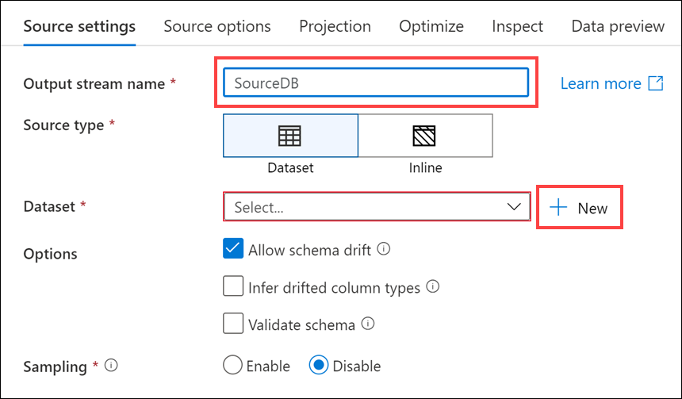

8. In the new integration dataset dialog, select **Azure SQL Database**, then select **Continue**.

    

9. In the dataset properties, configure the following:

    - **Name**: Enter `SourceCustomer`
    - **Linked service**: Select `AzureSqlDatabase`
    - **Table name**: Select `SalesLT.Customer`

    

10. Select **OK** to create the dataset.

11. The `SourceCustomer` dataset should now appear and be selected as the dataset for the source settings.

    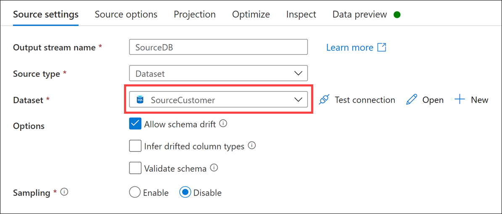

12. Select **+** to the right of the `SourceDB` source on the canvas, then select **Derived Column**.

    

13. Under `Derived column's settings`, configure the following properties:

    - **Output stream name**: Enter `CreateCustomerHash`
    - **Incoming stream**: Select `SourceDB`
    - **Columns**: Enter the following:

    | Column | Expression | Description |
    | --- | --- | --- |
    | Type in `HashKey` | `sha2(256, iifNull(Title,'') +FirstName +iifNull(MiddleName,'') +LastName +iifNull(Suffix,'') +iifNull(CompanyName,'') +iifNull(SalesPerson,'') +iifNull(EmailAddress,'') +iifNull(Phone,''))` | Creates a SHA256 hash of the table values. We use this to detect row changes by comparing the hash of the incoming records to the hash value of the destination records, matching on the `CustomerID` value. The `iifNull` function replaces null values with empty strings. Otherwise, the has values tend to duplicate when null entries are present. |

    

14. Click in the **Expression** text box, then select **Open expression builder**.

    

15. Select **Refresh** next to `Data preview` to preview the output of the `HashKey` column, which uses the `sha2` function you added. you should see that each hash value is unique.

    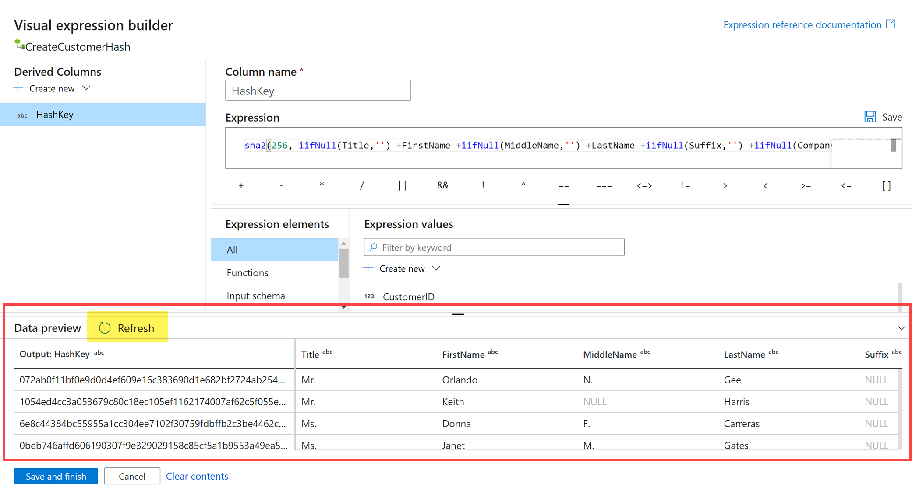

16. Select **Save and finish** to close the expression builder.

17. Select **Add Source** on the canvas underneath the `SourceDB` source. We need to add the `DimCustomer` table located in the Synapse dedicated SQL pool to use when comparing the existence of records and for comparing hashes.

    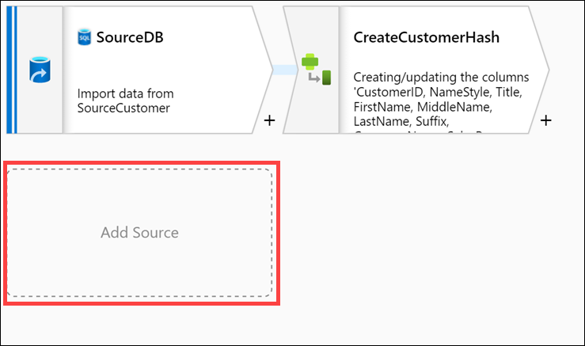

18. Under `Source settings`, configure the following properties:

    - **Output stream name**: Enter `SynapseDimCustomer`
    - **Source type**: Select `Dataset`
    - **Options**: Check `Allow schema drift` and leave the other options unchecked
    - **Sampling**: Select `Disable`
    - **Dataset**: Select **+ New** to create a new dataset

    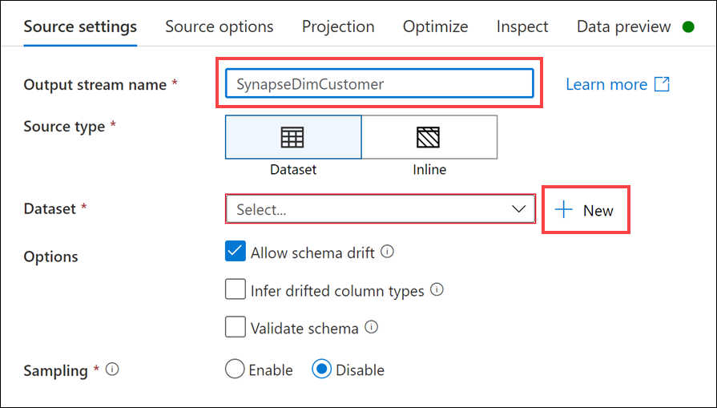

19. In the new integration dataset dialog, select **Azure Synapse Analytics**, then select **Continue**.

    

20. In the dataset properties, configure the following:

    - **Name**: Enter `DimCustomer`
    - **Linked service**: Select the Synapse workspace linked service
    - **Table name**: Select the **Refresh button** next to the dropdown

    

21. In the **Value** field, enter `SQLPool01`, then select **OK**.

    

22. Select `dbo.DimCustomer` under **Table name**, select `From connection/store` under **Import schema**, then select **OK** to create the dataset.

    

23. The `DimCustomer` dataset should now appear and be selected as the dataset for the source settings.

    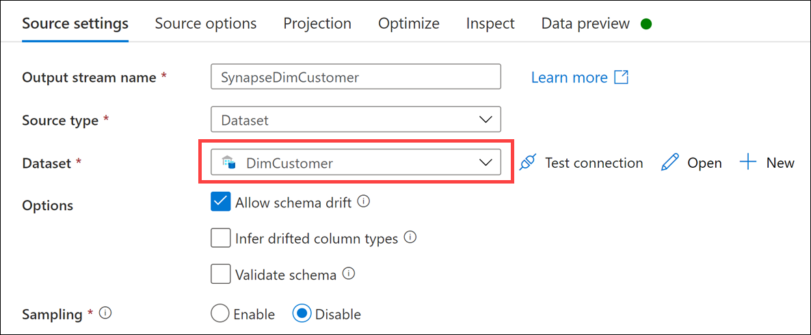

24. Select **Open** next to the `DimCustomer` dataset that you added.

    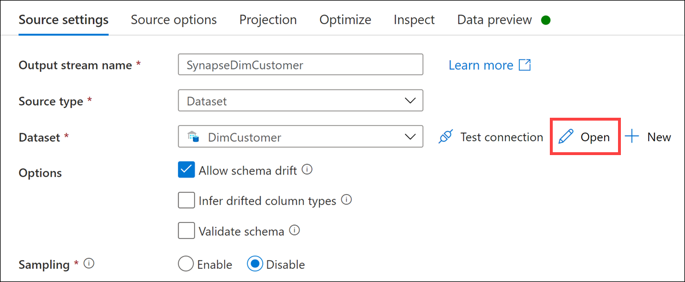

25. Enter `SQLPool01` in the **Value** field next to `DBName`.

    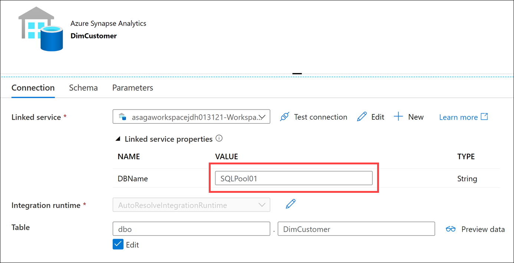

26. Switch back to your data flow. *Do not* close the `DimCustomer` dataset. Select **+** to the right of the `CreateCustomerHash` derived column on the canvas, then select **Exists**.

    

27. Under `Exists settings`, configure the following properties:

    - **Output stream name**: Enter `Exists`
    - **Left stream**: Select `CreateCustomerHash`
    - **Right stream**: Select `SynapseDimCustomer`
    - **Exist type**: Select `Doesn't exist`
    - **Exists conditions**: Set the following for Left and Right:

    | Left: CreateCustomerHash's column | Right: SynapseDimCustomer's column |
    | --- | --- |
    | `HashKey` | `HashKey` |

    

28. Select **+** to the right of `Exists` on the canvas, then select **Lookup**.

    

29. Under `Lookup settings`, configure the following properties:

    - **Output stream name**: Enter `LookupCustomerID`
    - **Primary stream**: Select `Exists`
    - **Lookup stream**: Select `SynapseDimCustomer`
    - **Match multiple rows**: Unchecked
    - **Match on**: Select `Any row`
    - **Lookup conditions**: Set the following for Left and Right:

    | Left: Exists's column | Right: SynapseDimCustomer's column |
    | --- | --- |
    | `CustomerID` | `CustomerID` |

    

30. Select **+** to the right of `LookupCustomerID` on the canvas, then select **Derived Column**.

    

31. Under `Derived column's settings`, configure the following properties:

    - **Output stream name**: Enter `SetDates`
    - **Incoming stream**: Select `LookupCustomerID`
    - **Columns**: Enter the following:

    | Column | Expression | Description |
    | --- | --- | --- |
    | Select `InsertedDate` | `iif(isNull(InsertedDate), currentTimestamp(), {InsertedDate})` | If the `InsertedDate` value is null, insert the current timestamp. Otherwise, use the `InsertedDate` value. |
    | Select `ModifiedDate` | `currentTimestamp()` | Always update the `ModifiedDate` value with the current timestamp. |

    

    > **Note**: To insert the second column, select **+ Add** above the Columns list, then select **Add column**.

32. Select **+** to the right of the `SetDates` derived column step on the canvas, then select **Alter Row**.

    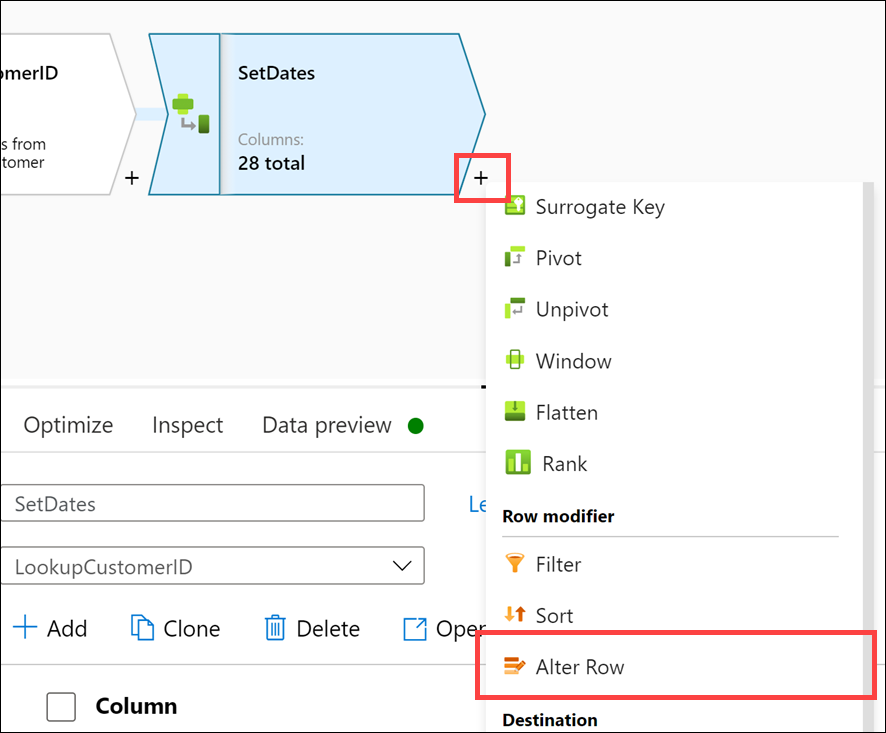

33. Under `Alter row settings`, configure the following properties:

    - **Output stream name**: Enter `AllowUpserts`
    - **Incoming stream**: Select `SetDates`
    - **Alter row conditions**: Enter the following:

    | Condition | Expression | Description |
    | --- | --- | --- |
    | Select `Upsert if` | `true()` | Set the condition to `true()` on the `Upsert if` condition to allow upserts. This ensures that all data that passes through the steps in the mapping data flow will be inserted or updated into the sink. |

    

34. Select **+** to the right of the `AllowUpserts` alter row step on the canvas, then select **Sink**.

    

35. Under `Sink`, configure the following properties:

    - **Output stream name**: Enter `Sink`
    - **Incoming stream**: Select `AllowUpserts`
    - **Sink type**: Select `Dataset`
    - **Dataset**: Select `DimCustomer`
    - **Options**: Check `Allow schema drift` and uncheck `Validate schema`

    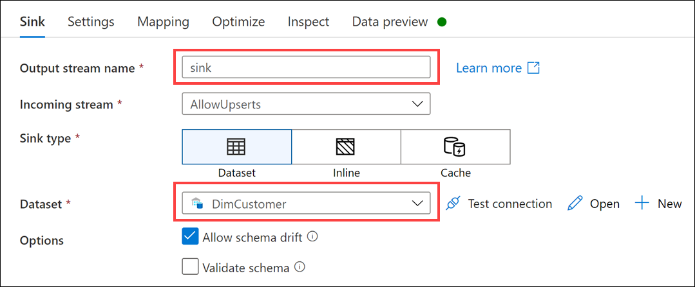

36. Select the **Settings** tab and configure the following properties:

    - **Update method**: Check `Allow upsert` and uncheck all other options
    - **Key columns**: Select `List of columns`, then select `CustomerID` in the list
    - **Table action**: Select `None`
    - **Enable staging**: Unchecked

    

37. Select the **Mapping** tab, then uncheck **Auto mapping**. Configure the input columns mapping as outlined below:

    | Input columns | Output columns |
    | --- | --- |
    | `SourceDB@CustomerID` | `CustomerID` |
    | `SourceDB@Title` | `Title` |
    | `SourceDB@FirstName` | `FirstName` |
    | `SourceDB@MiddleName` | `MiddleName` |
    | `SourceDB@LastName` | `LastName` |
    | `SourceDB@Suffix` | `Suffix` |
    | `SourceDB@CompanyName` | `CompanyName` |
    | `SourceDB@SalesPerson` | `SalesPerson` |
    | `SourceDB@EmailAddress` | `EmailAddress` |
    | `SourceDB@Phone` | `Phone` |
    | `InsertedDate` | `InsertedDate` |
    | `ModifiedDate` | `ModifiedDate` |
    | `CreateCustomerHash@HashKey` | `HashKey` |

    

38. The completed mapping flow should look like the following. Select **Publish all** to save your changes.

    

39. Select **Publish**.

    

### Task 3: Create a pipeline and run the data flow

In this task, you create a new Synapse integration pipeline to execute the mapping data flow, then run it to upsert customer records.

1. Navigate to the **Integrate** hub.

    

2. Select **+**, then select **Pipeline**.

    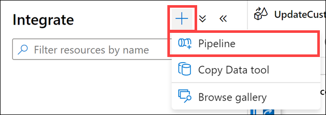

3. In the properties pane of the new pipeline, enter `RunUpdateCustomerDimension` in the **Name** field **(1)**, then select the **Properties** button **(2)** to hide the properties pane.

    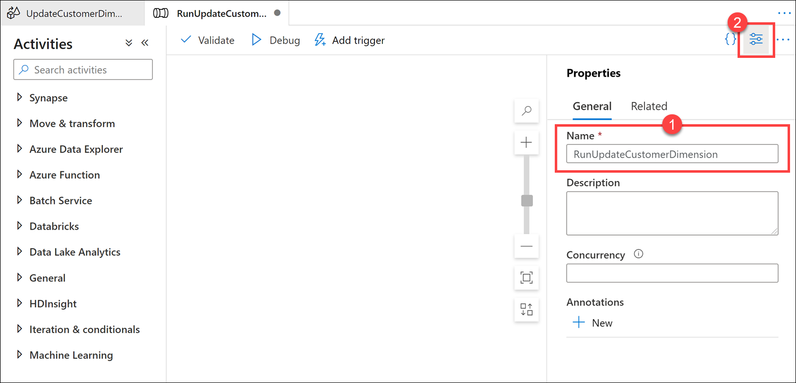

4. Under the Activities pane to the left of the design canvas, expand `Move & transform`, then drag and drop the **Data flow** activity onto the canvas.

    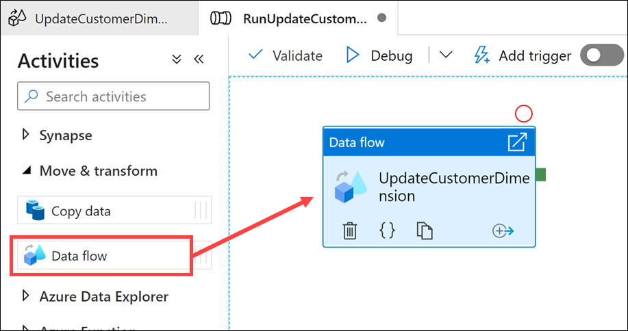

5. Under the `General` tab, enter **UpdateCustomerDimension** for the name.

    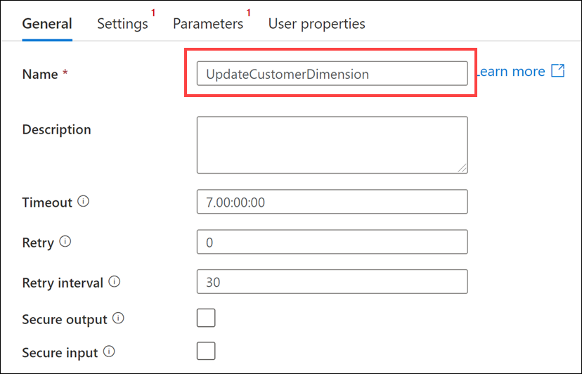

6. Under the `Settings` tab, select the **UpdateCustomerDimension** data flow.

    

6. Select **Publish all**, then select **Publish** in the dialog that appears.

    

7. After publishing completes, select **Add trigger** above the pipeline canvas, then select **Trigger now**.

    

8. Navigate to the **Monitor** hub.

    

9. Select **Pipeline runs** in the left-hand menu **(1)** and wait for the pipeline run to successfully complete **(2)**. You may have to select **Refresh (3)** several times until the pipeline run completes.

    

### Task 4: View inserted data

1. Navigate to the **Data** hub.

    

2. Select the **Workspace** tab **(1)**, expand Databases, then right-click on **SQLPool01 (2)**. Select **New SQL script (3)**, then select **Empty script (4)**.

    

3. Paste the following in the query window, then select **Run** or hit F5 to execute the script and view the results:

    ```sql
    SELECT * FROM DimCustomer
    ```

    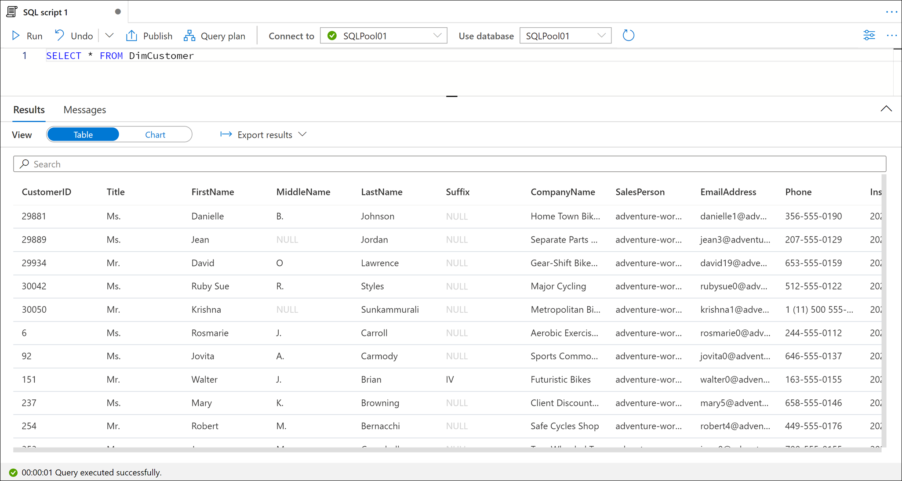

### Task 5: Update a source customer record

1. Open Azure Data Studio, or switch back to it if still open.

2. Select **Servers** in the left-hand menu, then right-click the SQL server you added at the beginning of the lab. Select **New Query**.

    

3. Paste the following into the query window to view the customer with a `CustomerID` of 10:

    ```sql
    SELECT * FROM [SalesLT].[Customer] WHERE CustomerID = 10
    ```

4. Select **Run** or hit `F5` to execute the query.

    

    The customer for Ms. Kathleen M. Garza is displayed. Let's change the customer's last name.

5. Replace **and execute** the query with the following to update the customer's last name:

    ```sql
    UPDATE [SalesLT].[Customer] SET LastName = 'Smith' WHERE CustomerID = 10
    SELECT * FROM [SalesLT].[Customer] WHERE CustomerID = 10
    ```

    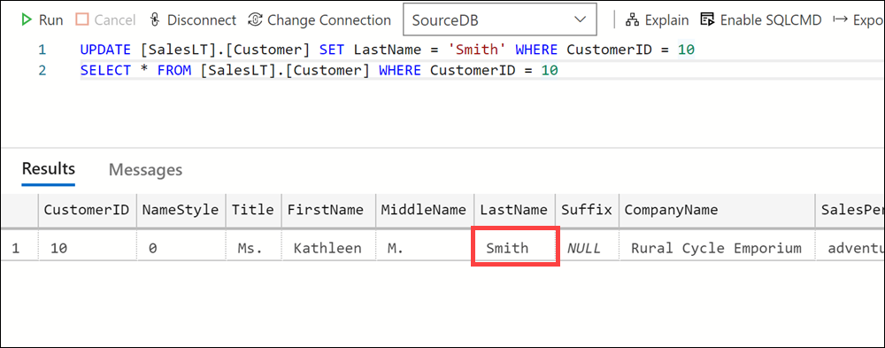

### Task 6: Re-run mapping data flow

1. Switch back to Synapse Studio.

2. Navigate to the **Integrate** hub.

    

3. Select the **RunUpdateCustomerDimension** pipeline.

    

4. Select **Add trigger** above the pipeline canvas, then select **Trigger now**.

    

5. Select **OK** in the `Pipeline run` dialog to trigger the pipeline.

    

6. Navigate to the **Monitor** hub.

    

7. Select **Pipeline runs** in the left-hand menu **(1)** and wait for the pipeline run to successfully complete **(2)**. You may have to select **Refresh (3)** several times until the pipeline run completes.

    

### Task 7: Verify record updated

1. Navigate to the **Data** hub.

    

2. Select the **Workspace** tab **(1)**, expand Databases, then right-click on **SQLPool01 (2)**. Select **New SQL script (3)**, then select **Empty script (4)**.

    

3. Paste the following in the query window, then select **Run** or hit F5 to execute the script and view the results:

    ```sql
    SELECT * FROM DimCustomer WHERE CustomerID = 10
    ```

    

    As we can see, the customer record successfully updated to modify the `LastName` value to match the source record.

## Exercise 6: Cleanup

Complete these steps to free up resources you no longer need.

### Task 1: Pause the dedicated SQL pool

1. Open Synapse Studio (<https://web.azuresynapse.net/>).

2. Select the **Manage** hub.

    

3. Select **SQL pools** in the left-hand menu **(1)**. Hover over the name of the dedicated SQL pool and select **Pause (2)**.

    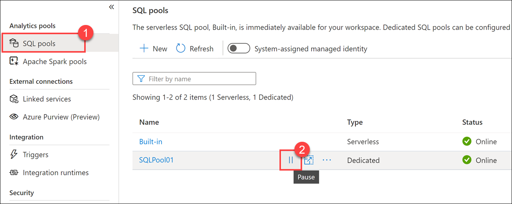

4. When prompted, select **Pause**.

    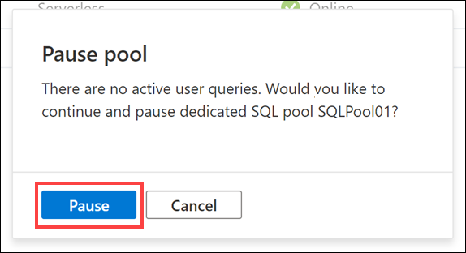
